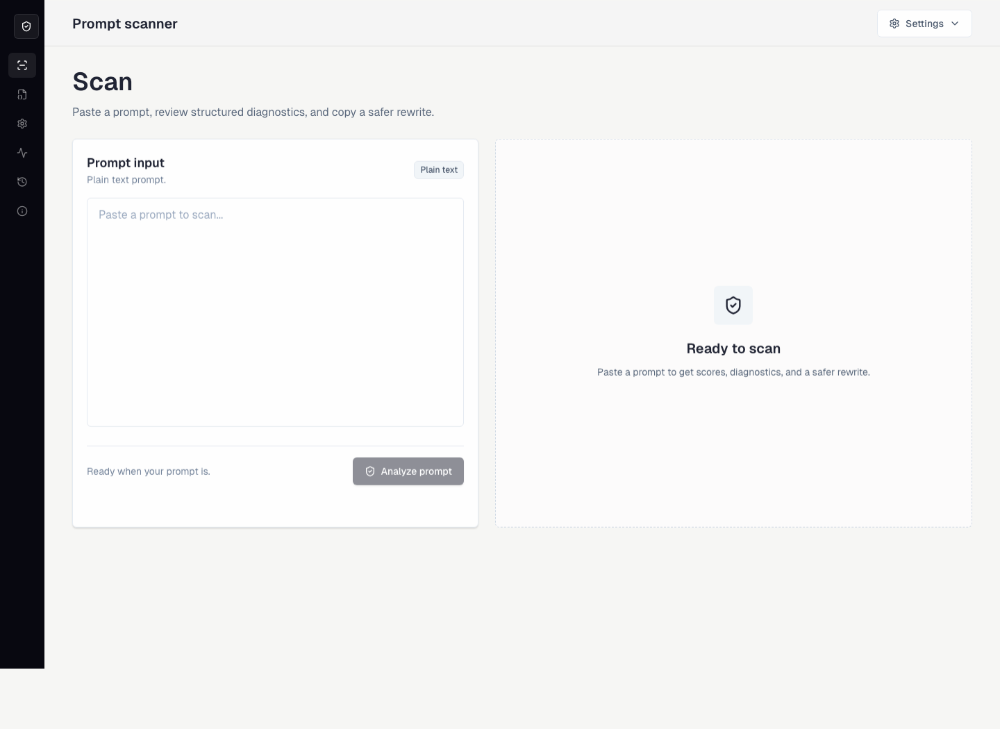

# PromptGuard

PromptGuard catches vague, unsafe, and privacy-risky prompts before they reach an AI model.

[Live demo](https://promptguard-rho.vercel.app) · [Scanner](https://promptguard-rho.vercel.app/scanner) · [Repository](https://github.com/kenny2077/PromptGuard)

PromptGuard is a focused prompt preflight tool for people building with LLMs. Paste a prompt, get structured diagnostics, review severity and category scores, then copy a safer rewrite. The core scanner is deterministic, fast, privacy-friendly, and designed to work without accounts, a database, or an API key.

## Preview




## Why It Matters

Prompt quality is now product quality. A vague prompt can create unreliable output, a privacy-heavy prompt can leak sensitive data, and a malicious instruction can try to override the intended behavior of an AI system. PromptGuard gives builders a simple review step before a prompt is sent downstream.

It works like spellcheck plus safety review for prompts:

- Find vague wording, missing structure, and conflicting requirements
- Flag prompt-injection language and secret-exfiltration requests
- Detect likely sensitive data such as emails, phone numbers, SSNs, tokens, and API-key-like strings
- Generate a cleaner rewritten prompt with boundaries, output format, and constraints
- Keep the default workflow local-first and deterministic

## Product Experience

PromptGuard is built around one polished workflow:

1. Paste a prompt or OpenAI-style message array.
2. Tune privacy, clarity, and security strictness.
3. Run the deterministic scanner.
4. Review scores, severity groups, evidence, and suggested fixes.
5. Copy a safer rewrite or a structured JSON report.

The app also includes demo examples for vague prompts, prompt-injection attempts, privacy leaks, and poorly structured work prompts so the value is clear in a short live demo.

## Core Features

| Area | What PromptGuard Provides |
| --- | --- |
| Deterministic analysis | A TypeScript rule engine that runs quickly and predictably |
| Structured diagnostics | Rule IDs, severity, category, evidence, source surface, location, and suggestion |
| Scoring | Overall, clarity, security, structure, and privacy scores |
| Rewrite generation | Deterministic safer rewrites that preserve intent and add structure |
| Privacy handling | Redaction suggestions for obvious sensitive data patterns |
| Injection checks | Detection for override phrases, secret requests, obfuscation, and unsafe placeholders |
| Message parsing | Plain-text and message-array prompt input modes |
| Optional AI layer | OpenAI-assisted rewrite refinement when `OPENAI_API_KEY` is configured |
| Deployment | No database or auth required; deploys cleanly to Vercel |

## Rule Coverage

PromptGuard intentionally keeps the rule set understandable and demoable. It focuses on high-signal issues rather than trying to be an enterprise threat-intelligence product.

| Rule | Default Severity | Category |
| --- | --- | --- |
| `vague-instruction` | warning | clarity |
| `missing-output-format` | warning | structure |
| `missing-task-definition` | error | clarity |
| `contradictory-directives` | warning | clarity |
| `prompt-injection-risk` | critical | security |
| `secret-exfiltration-risk` | critical | security |
| `undelimited-user-input` | error | security |
| `obfuscated-attack-pattern` | critical | security |
| `sensitive-data-leak` | error | privacy |
| `excessive-length` | warning | efficiency |
| `repeated-instructions` | info | efficiency |
| `missing-examples-for-complex-task` | info | structure |

## Architecture

```text
app/
  api/rewrite/route.ts        Optional OpenAI-assisted rewrite route
  icon.svg                    PromptGuard app icon and favicon source
  layout.tsx                  App metadata and font setup
  page.tsx                    Product landing page
  scanner/page.tsx            Scanner route

components/
  contact-cta.tsx             Contact and demo request modal
  landing-page.tsx            Product landing experience
  promptguard-app.tsx         Scanner console
  reveal-on-scroll.tsx        Lightweight scroll reveal component
  ui/                         Small shadcn-style primitives

lib/
  analysis/                   Parser, normalization, decoder, rules, scoring
  examples/                   Built-in demo prompts
  rewrite/                    Deterministic rewrite engine

tests/
  analysis.test.ts            Rule, scoring, parser, decoder, and rewrite tests

types/
  analysis.ts                 Shared TypeScript contracts
```

### Analysis Pipeline


The scanner builds a small prompt document, estimates metadata, scans original plus normalized and decoded surfaces, and returns a structured `AnalysisReport`. The rewrite engine then redacts obvious sensitive values, neutralizes risky language, wraps unsafe placeholders, and organizes the prompt into task, boundaries, output format, and constraints.

## Tech Stack

- Next.js 16 with App Router
- React 19
- TypeScript
- Tailwind CSS
- shadcn-style UI primitives
- lucide-react icons
- Vitest
- Optional OpenAI Responses API route
- Vercel deployment

## Getting Started

```bash
npm install
npm run dev
```

Open `http://localhost:3000`.

## Scripts

```bash
npm run lint
npm run test
npm run build
npm run start
```

## Optional AI Rewrite

PromptGuard works fully without an API key. If you want AI-assisted rewrite refinement, set:

```bash
OPENAI_API_KEY=your_key
```

Optional:

```bash
OPENAI_MODEL=gpt-5
```

When no key is present or the API request fails, the app falls back to deterministic rewrite output.

## Deploy to Vercel

1. Push the repository to GitHub.
2. Import the project into Vercel.
3. Keep the default Next.js build settings.
4. Add `OPENAI_API_KEY` only if AI-assisted rewrite refinement is needed.
5. Deploy.

The production deployment for this project is available at:

https://promptguard-rho.vercel.app

## Project Principles

- Keep the product focused on one excellent prompt review workflow.
- Make deterministic analysis the reliable core.
- Treat AI assistance as additive, never required.
- Prefer clear diagnostics over opaque scoring.
- Avoid storing user prompts on a backend.
- Keep the interface calm, professional, and demo-ready.

## Roadmap

- Inline evidence highlighting in the prompt input
- Exportable PDF or Markdown reports
- Shareable local demo states
- Expanded prompt-injection fixtures
- Rule configuration presets for product, education, and support workflows
- Optional team policy packs

## Contact

- Product: [PromptGuard live demo](https://promptguard-rho.vercel.app)
- GitHub: [kenny2077](https://github.com/kenny2077)
- LinkedIn: [Kaiyi Guo](https://www.linkedin.com/in/kaiyi-guo-917462290/)
